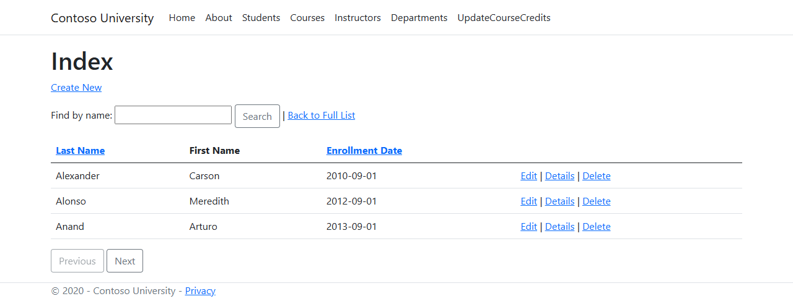
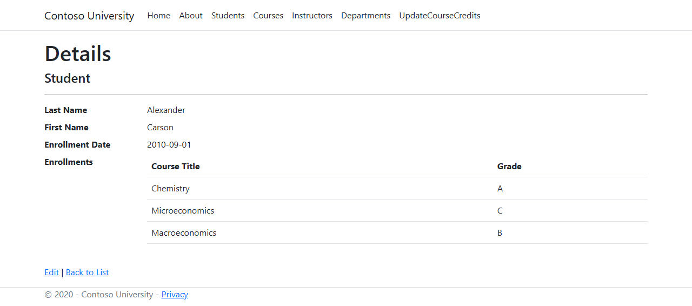
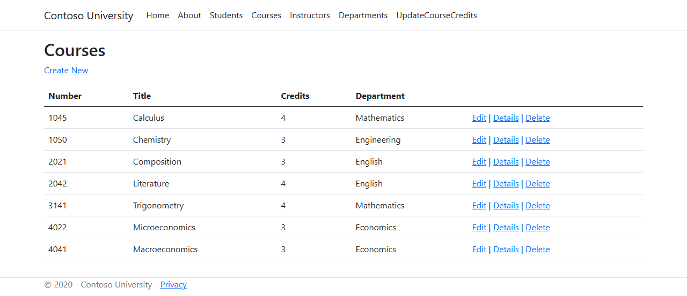
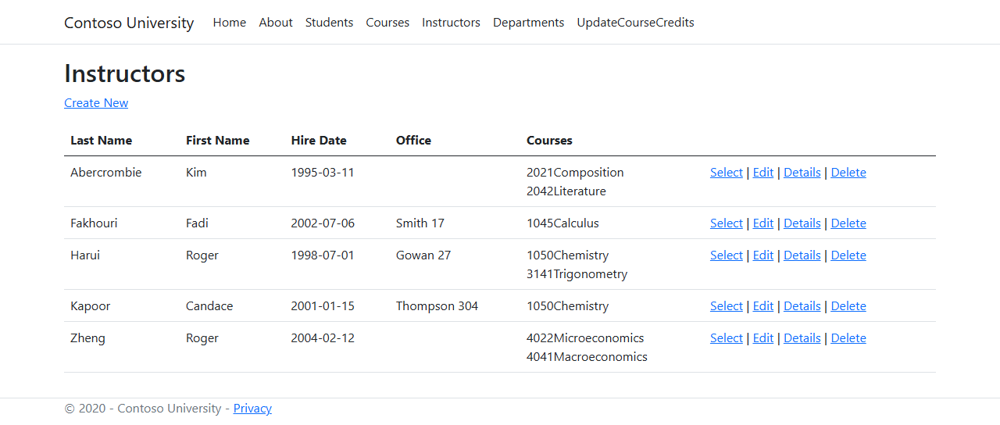
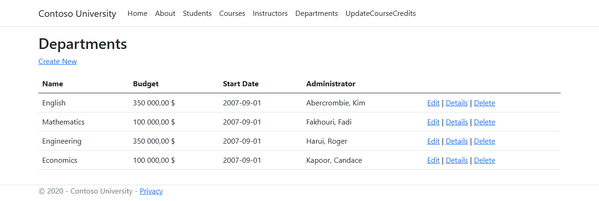
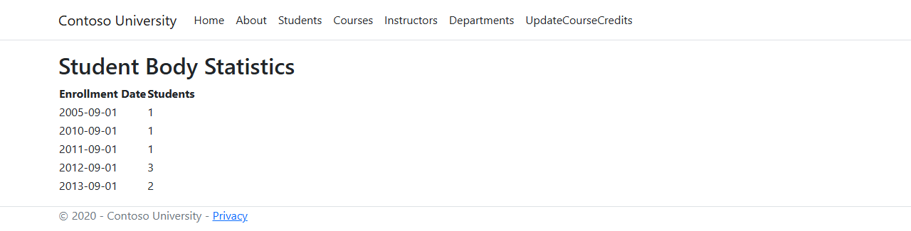

# ContosoUniversity

[](https://github.com/Arthure-code/ContosoUniversity/actions/workflows/build.yml)
[](https://sonarcloud.io/summary/new_code?id=Arthure-code_ContosoUniversity)
[](https://sonarcloud.io/summary/new_code?id=Arthure-code_ContosoUniversity)
[](https://sonarcloud.io/summary/new_code?id=Arthure-code_ContosoUniversity)
[](https://sonarcloud.io/summary/new_code?id=Arthure-code_ContosoUniversity)
[](https://sonarcloud.io/summary/new_code?id=Arthure-code_ContosoUniversity)
[](https://sonarcloud.io/summary/new_code?id=Arthure-code_ContosoUniversity)
[](https://sonarcloud.io/summary/new_code?id=Arthure-code_ContosoUniversity)

A school is a web of relations: a student enrols in courses, a course belongs
to a department, an instructor teaches several courses, and one instructor
administers a department. Who teaches what, who pays for what, who got which
grade. Every page answers one of those questions.

ASP.NET Core 8 MVC, Entity Framework Core 8, SQL Server LocalDB.

## Screenshots

**Students**



**A student and their grades**



**Courses**



**Instructors**



**Departments**



**Student body statistics**



## How it works

**Two kinds of people, one table.** Students and instructors inherit from a
`Person` class and share a single table, told apart by a discriminator
column. A name is defined once, for both.

**The schema comes from the migrations.** They run at startup and the seed
data follows, so a clone with an empty server gets a working database on the
first run.

**A department will not be overwritten in silence.** Its row version travels
with the form. A save built on an outdated version is refused, and the page
shows, field by field, what the other user wrote.

**Identifiers come from the address, never from the form.** The keys refuse
model binding, so a posted identifier cannot send a save to another record.

**Long lists are handled by the database.** The student list sorts on the
clicked column, filters on the searched name and fetches one page at a time,
rather than loading everything and cutting it in memory.

**SQL where SQL is the right tool.** The statistics group enrolments by date
in a single query, and the credit multiplier updates every course in one
statement.

## Running it

```bash
cd ContosoUniversity
dotnet run
```

The connection string sits in `appsettings.json` and points at SQL Server
LocalDB. The database is created, migrated and seeded on the first run.

## Résumé

Une université, avec ses étudiants, ses cours, ses enseignants et ses
départements, et surtout les liens entre eux : qui enseigne quoi, quel
département paie quel cours, quelle note un étudiant a obtenue. Les listes
se trient, se filtrent et se paginent du côté de la base. La modification
d'un département refuse d'écraser celle d'un autre utilisateur et montre ce
qui a changé. Les identifiants viennent toujours de l'adresse, jamais du
formulaire.

## Licence

MIT. See [LICENSE](LICENSE).
